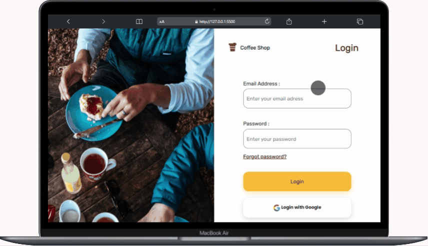
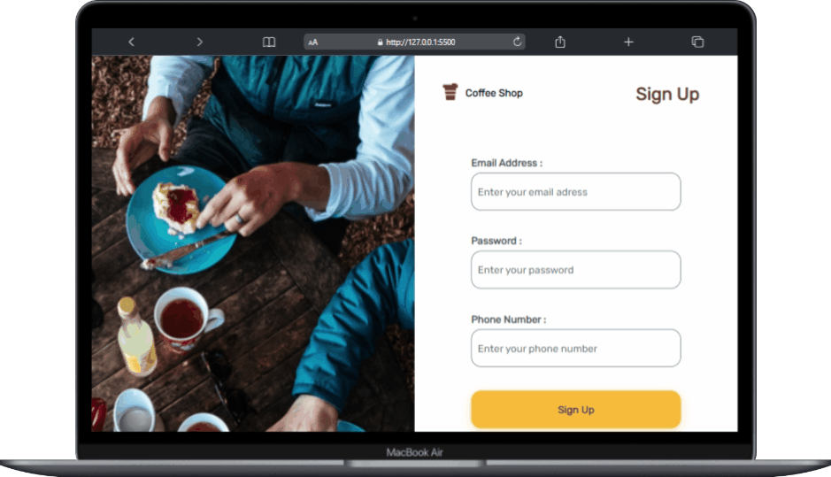
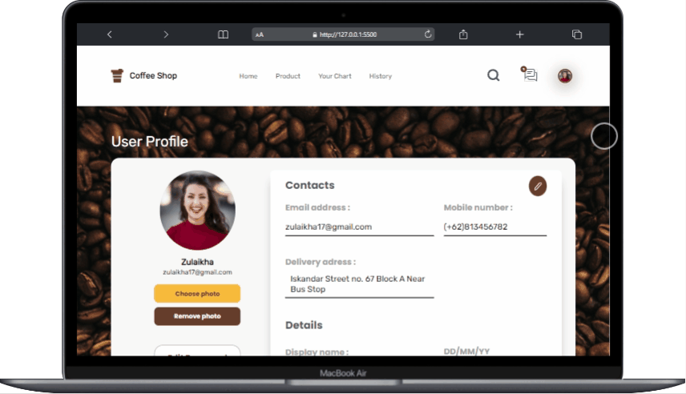
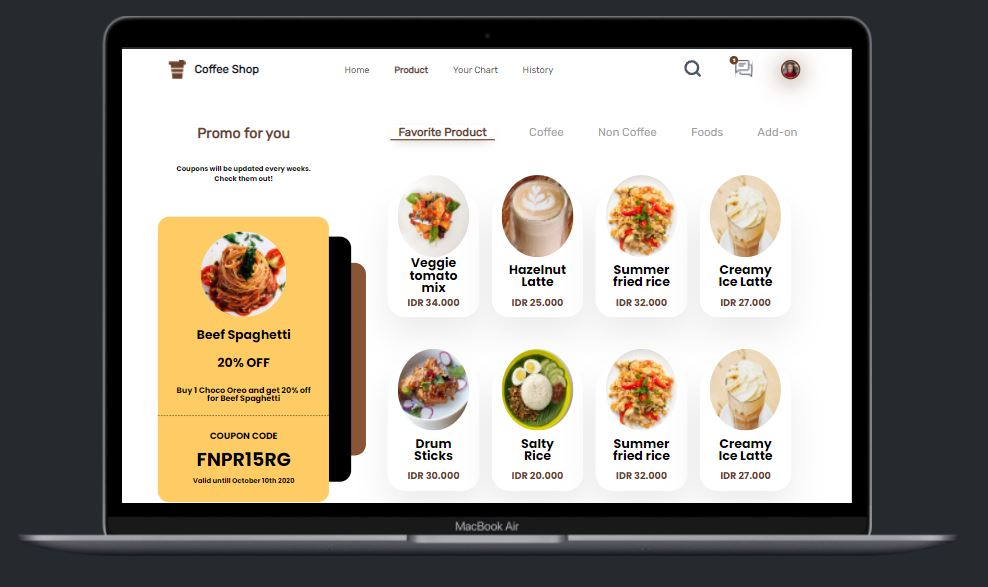
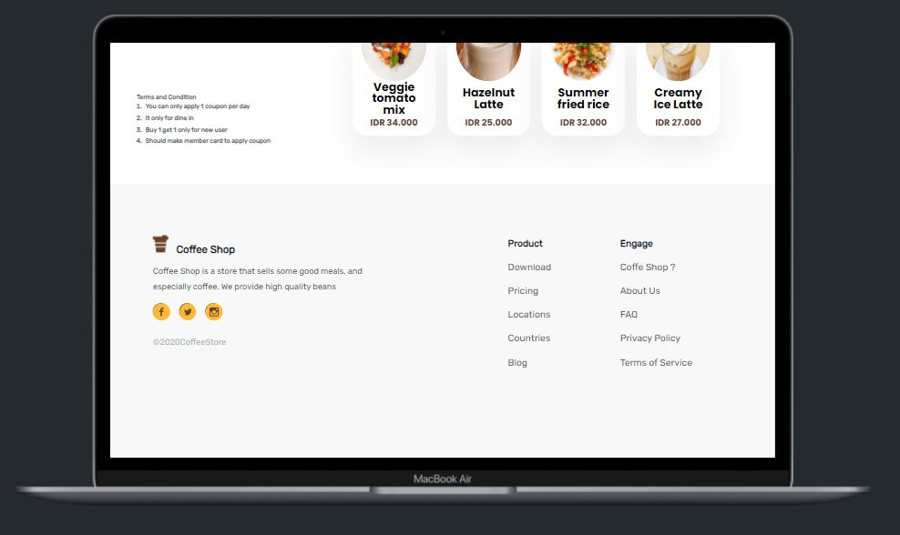

<h1 style="text-align:center">Coffee Store Front End</h1>

 

## Built With

## How to Instal

1.  Clone git repository

        $ git clone https://github.com/RivaldiSiby/Rcoffee-client.git

2.  Open [VS Code](https://code.visualstudio.com/download)
3.  Right Click _index.html_ then choose **Open with live Server**

## Preview

<h4>PAGE INDEX </h4>

<h4>PAGE LOGIN </h4>

<h4>PAGE SIGN UP </h4>

<h4>PAGE PROFILE </h4>

<h4>PAGE PRODUCT </h4>

## Related Project
